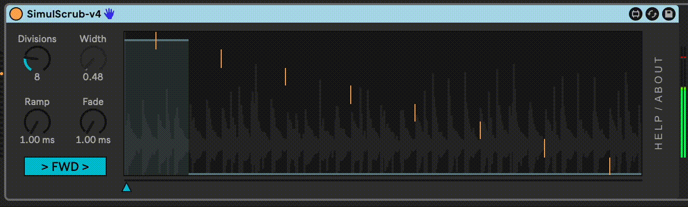

# SimulScrub

SimulScrub is a Max for Live device that plays a number of contiguous time segments of an audio file simultaneously, with a flexible crossfader control to select which segment(s) you want to hear.

This allows you to scrub through time of a longer sample, while always playing the sample at 1x speed. 🤯

I created this plugin after using my [Chiastic Slide](https://github.com/zsteinkamp/m4l-ChiasticSlide) plugin to do this job using an instrument rack with N chains, each containing a Simpler device playing its own slide of a larger audio file. Setting that up was a fairly involved process and cumbersome to operate to keep N Simplers in sync, parameter-wise (even using "Copy to (n) siblings").

SimulScrub has a simple drag and drop workflow. Just drag an audio sample or file to the main plugin area and play any MIDI note to start playing. Automate or modulate the `Position` slider and `Width` knob. See how different numbers of slices (up to 32) changes things.

## Installation

[Download the newest release](https://github.com/zsteinkamp/m4l-SimulScrub/releases) or clone this repository, and drag the `SimulScrub.amxd` device into a track in Ableton Live.

## Changelog

- 2024-04-13 [v1](https://github.com/zsteinkamp/m4l-SimulScrub/releases/download/v1/SimulScrub-v1.amxd) - Initial Release.

## Usage

Add this device to a MIDI track, then drag an audio clip or file to the main plugin area.

Select the number of slices with the `Divisions` knob.

Select which slice you are hearing with the `Position` slider.

Control how many adjacent slices are also heard with the `Width` knob.

## TODO

* Slice by ms, measures
* Reverse toggle

## Contributing

I'd love it if others extended this device. If you would like to contribute, simply fork this repo, make your changes, and open a pull request and I'll have a look.
